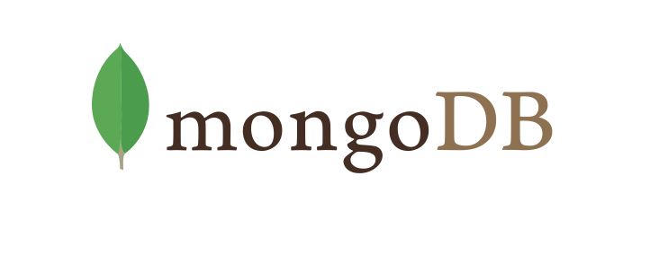
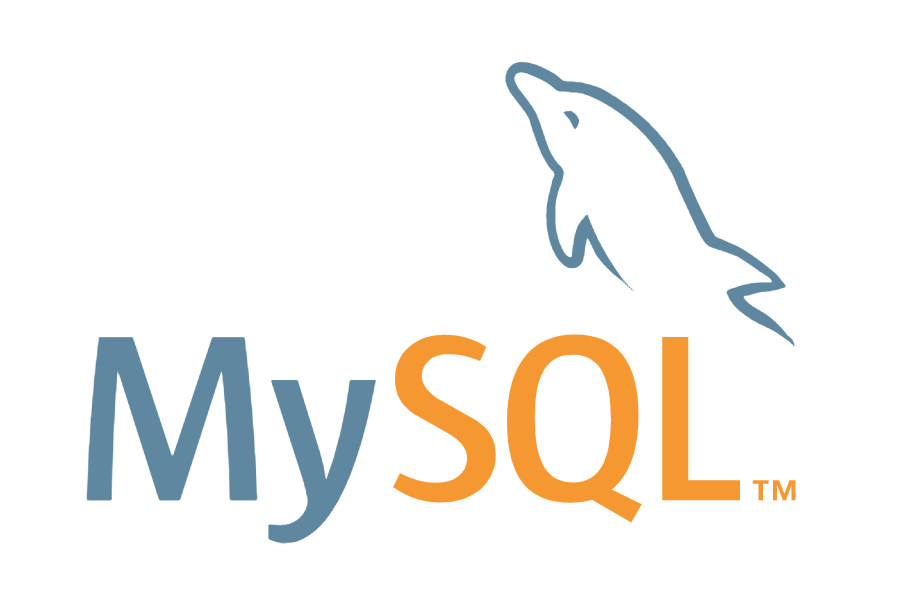

## Welcome to my ePortfolio!
My name is Christina and I am attaining a Bachelor's of Science from Southern New Hampshire University studying software engineering. Below is a showcase of my capstone work and narratives for each project to present what I was able to create and my learning process.

## Professional Assessment
write things here!

## Code Review

Here is the link to the code review I performed on three artifacts I worked on while pursuing my education at Southern New Hampshire University studying computer science. [click here](https://youtu.be/KW-qXvNUJ6U) to view this in YouTube or play the video down below. Thanks for watching!

<iframe width="560" height="315" src="https://www.youtube.com/embed/KW-qXvNUJ6U" frameborder="0" allow="accelerometer; autoplay; encrypted-media; gyroscope; picture-in-picture" allowfullscreen></iframe>

## Software Design and Engineering Enhancement
### C++, OpenGL, ASSIMP, and Blender

For my first artifact, I worked on improving my final project from my CS 330: Computational Graphics and Visualization course. For that course’s final project, I built a 3D cheeseburger with the ability to change the visual perspective by the user. Using hotkeys, the user could pan around the burger that was also rotating on its own. I took this course during the 20EW4 term. When uploaded this project, I had to remove the glm and SOIL2 folders from my project. You will need to add these items in to get the program to render the object. Moreover, you will need to set up the dependencies and libraries appropriately.

I wanted to include this artifact in my ePortfolio, because I was excited to work on creating a better version of my 3D object. It would allow me to practice writing in C++, learn more about OpenGL, and work with the ASSIMP library. My previous work included pain-stakingly typing in every vertex point of every triangle that comprised my cheeseburger. Unsurprisingly, there were missing sides. I was able to successfully load a complete 3D cheeseburger with a (relatively) low polygon-count that I created on Blender from importing its .obj file. This was the most challenging part of the project and I relied heavily on reading from a the [LearnOpenGL](https://learnopengl.com/) website authored by Joey de Vries. I had to sort out and parse the different categories of data from Blender and use this to attach texture files to. The hotkeys for this project are "W" to zoom in, "S" to zoom out, "A" to pan left, and "D" to pan right.

I met the course I objectives I planned for myself with these enhancement. I implemented techniques and design skills to import data from an obj file in order to improve the rendering of the object which demonstrates computer solutions that deliver value and accomplish industry-specific goals. Moreover, learning objectives 1 and 2 were met by providing meaningful comments in my code that supports building a collaborative environment with coherent communication. Overall, I am happy with what I produced and look forward to experimenting more with OpenGL and possibly creating a scene around my 3D burger!

## Algorithms and Data Structures Enhancement
### Bottle Framework, Python, MongoDB, and yfinance Python package

For my second artifact, I worked on improving my final project from my CS 340: Advanced Programming Concepts course. For that course’s final project, we needed to create a RESTful API web service using Python and MongoDB to implement a Stock Market program. I took this course during the 20EW5 term.

I wanted to include this artifact in my ePortfolio in order to gain more experience writing code in Python and work with MongoDB. Moreover, I wanted practice working with other python packages. This project required using the yfinance package, pymongo, and the Bottle framework. Bottle is a good choice for creating small applications to create a quick prototype. For future projects, I plan to learn and incorporate using Flask and Django as these are more popular frameworks due to scalability, simplicity, and power/capabilities. My most difficult challenge was finding a way to import real-time and current data from the stock market to incorporate into my project. On top of the previous work I had done creating other queries and reports via a command line interface program, I added an additional feature to copmare the 50 and 200-Day Simple Moving Average (SMA) to analzye a particular stock company to consider wether it was a good time for purchasing stocks. The provided data in MongoDB that I received from my instructors had some glitches as I was ultimately able to update stock market information, however, some stock market companies held within my database do not exist in the present. My goal was to have all of the data update prior to starting the program, but after completing some trials so see how long it would take to update just a few stocks, I calculated the approximate time to update over 2,000 companies would take more than 3 hours! This was way too long, and my work around was to allow the user to pick a stock to inquire about and perform the data update on the spot. In the future, I would explore other options for drawing in data and using other finance APIs.

I met the course objectives and goals I created and the beginning of this term. I was able to demonstrate computing solutions using algorithmic principles and computer science practices/standards appropriate to this solution while managing trade-offs involved with design choices. I was excited to work with Python and the stock market data to learn about how coding can be used to invest money in a more smart and efficient way.

## Databases Enhancement
### MySQL

For my third artifact, I worked on expanding the knowledge-base and skills I gained from my DAD 220: Introduction to SQL course. For that course’s final project, we were required to create a new database from scratch, consisting of multiple tables. We also needed to populate the database, update records, and delete existing records to show our ability to implement CRUD function. We also created specific queries that applied to previous assignments.

I included this project into my ePortfolio, because I really enjoyed working with SQL databases before. There are a lot of opportunities for careers in database managements with the exponential rise in data storage around the world. I also had a great experience taking that course, and I know SQL and MongoDB are among the top databases to work with in the computer science and information careers. I was able to work with a fictitous company that dealt with commerce; there were a couple different databases created to demonstrate working with CRUD functions for different by related databases like that found in human resources, inventory, the company store, and invoicing. I displayed my ability to work with more complex queries and demonstrate practice with more advanced concepts of MySQL like creating views and triggers. Moreover, I included ways to set-up login and permissions into the database to address some security concerns. The biggest security threat for SQL databases are SQL injections when the database interfaces with a program the user interacts with. This project did not have a program interface, but to fulfill the security requirements of my final project I wrote about what it would take to salt and hash a password in Python as well as other ways to avoid SQL injection by ensuring the code parameterizes inputs. Salting is an added layer of security that makes a brute force attack a little bit more difficult by adding extra bytes of (important) information needed to create/retrieve/match a hashed password. The technique I utilized was comprised of a 32-byte salt and pbkdf2_hmac from the python hashlib library I learned from [Nitratine](https://nitratine.net/blog/post/how-to-hash-passwords-in-python/). I utilized resources from [OWASP SQL Injection Prevention](https://cheatsheetseries.owasp.org/cheatsheets/SQL_Injection_Prevention_Cheat_Sheet.html), [OWASP Query Parameterization](https://cheatsheetseries.owasp.org/cheatsheets/Query_Parameterization_Cheat_Sheet.html), and an article from an OWASP contributor on [avoiding SQL injections](https://owasp.org/www-community/attacks/SQL_Injection). To learn about creating Views and Triggers I learned from MySQLTutorial on [Views](https://www.mysqltutorial.org/mysql-views-tutorial.aspx) and [Triggers](https://www.mysqltutorial.org/mysql-triggers.aspx/#:~:text=In%20MySQL%2C%20a%20trigger%20is,is%20inserted%20into%20a%20table.).

I met the course I objectives I planned to meet with this enhancement. I was able to use my skills and techniques to implement design solutions and deliver comman tasks that would be required when working with MySQL databases. I also experienced aspects of having a security mindset that anticpates adversarial exploits by learning about salting/hasing passwords and learning how to implement techniques to avoid a SQL injection attack.
